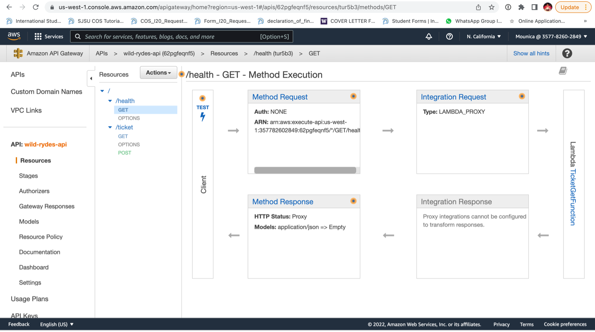

# Module: Build a Multi-Region Serverless Application for Resilience and High Availability

In this assignment we are building a Customer Ticketing application using Amazon API Gateway, AWS Lambda and Amazon DynamoDB.
 
 ## 1.	Create AWS Cloud9 Environment

 Now in command shell execute below commands- required for AngularJS front end

1.	nvm install 8.9.1
2.	nvm alias default v8.9.1
3.	git clone  https://github.com/enghwa/MultiRegion-Serverless-Workshop.git

 ## 2.	Building the Wild Rydes Backend Components Layer

In this module, we will deploy backend application components to 2 AWS Regions (Ireland and Singapore)

 These backend components include 3 AWS Lambda functions, 2 API Gateway Endpoints and DynamoDB Global Table per Region. 

We will also create the IAM polices, and roles required by these components.

# 1.	Create IAM Policies and Roles

IAM policy console-  Create one policy (TicketGetPolicy)

Next, create the 2 roles-

# 2. Create the DynamoDB Global Table-

# 3.	Create three Lambda functions-

# 4.	Create API Gateway Endpoint-

# 5.	Test your API Gateway Endpoints-

##  3.	Build a UI layer

## 4. Replicate to second region- 
1.	Replicate to a second region

S3 Cross-Region Replication (CRR):Cross-region replication (CRR) enables automatic, asynchronous copying of objects across buckets in different AWS Regions. To set up CRR when the source and destination buckets are owned by the same AWS account with the AWS CLI, you create source and destination buckets, enable versioning on the buckets, create an IAM role that gives Amazon S3 permission to replicate objects, and add the replication configuration to the source bucket.

•	Enabled versioning on your source bucket in the (primary) N. Virginia region using the command:
aws s3api put-bucket-versioning --bucket ticket-service-ui-websitebucket-11zvklqd9927o --versioning-configuration Status=Enabled

•	Created a destination bucket and enabled versioning on it:
aws s3api create-bucket --bucket ticket-service-ui-websitebucket-us-west-1 --region us-west-1 --create-bucket-configuration LocationConstraint=us-west-1

•	Created an IAM role and attached permissions policy to the role:

•	Added replication configuration to the source bucket. Run the following command to add the replication configuration to your source bucket. 
aws s3api create-bucket --bucket ticket-service-ui-websitebucket-us-west-1 --region us-west-1 --create-bucket-configuration LocationConstraint=us-west-1
•	Then again we run npm run build and aws s3 sync --delete dist/ s3://ticket-service-ui-websitebucket-us-west-1

•	Now, we got our source bucket objects in N. Virginia region replicated to the destination bucket in N. California region.

## 5. Test failover

Test CloudFront Failover: To test the CloudFront Failover, we deleted the S3 bucket (or objects) in the primary (N. Virginia) region.

We checked the multi-region active-active ticketing system works perfectly though the primary region (N. Virginia) has an issue in S3 or API gateway.

